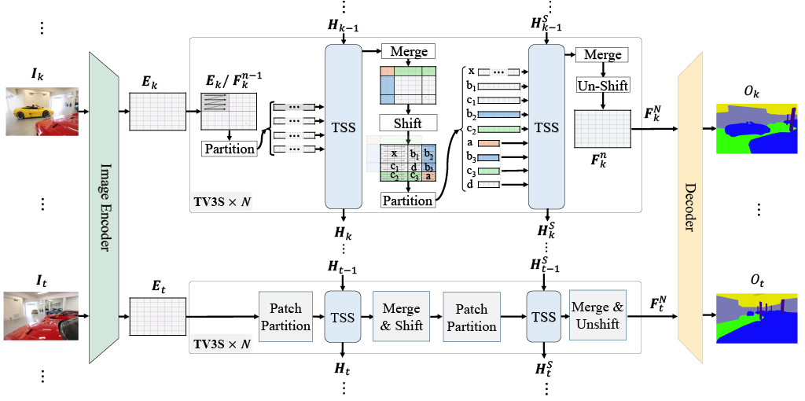

# TV³S: Exploiting Temporal State Space Sharing for Video Semantic Segmentation

[]()
[](LICENSE)
[](https://arxiv.org/abs/2503.20824)

**Exploiting Temporal State Space Sharing for Video Semantic Segmentation**  
Official PyTorch implementation of TV³S—Temporal Video State Space Sharing.

---

## 📖 Table of Contents

- [✨ Features](#-features)  
- [📝 Introduction](#-introduction)  
- [🎨 Architecture](#-architecture)  
- [👥 Authors](#-authors)  
- [🚀 Installation](#-installation)  
- [🎬 Quick Start](#-quick-start)  
- [🛠️ Usage](#-%EF%B8%8F-usage)  
  - [Data Preparation](#data-preparation)  
  - [Inference](#inference)  
  - [Training](#training)  
- [📊 Results](#-results)  
- [✅ TODO](#-todo)
- [📝 Citation](#-citation)  
- [🤝 Acknowledgements](#-acknowledgements)  
- [📬 Contact](#-contact)  

---

## ✨ Features

- **Efficient Temporal State Sharing**  
    Utilizes Mamba state space models to seamlessly propagate temporal features across frames, reducing computational overhead.  

- **Scalable Patch-Based Processing**  
    Processes spatial patches independently, enabling parallelization for enhanced throughput and scalability.  

- **Adaptive Temporal Gating**  
    Dynamically selects relevant temporal cues to ensure long-range coherence and robust segmentation.  

- **State-of-the-Art Results**  
    Achieves superior performance on benchmarks like VSPW and Cityscapes, delivering an optimal balance between accuracy and efficiency.  


---
## 📝 Introduction

Video semantic segmentation (VSS) plays a crucial role in understanding dynamic scenes over time. Conventional methods often process each frame or short clips independently, leading to fragmented context and high memory overhead. TV³S (Temporal Video State Space Sharing) addresses these limitations through innovative strategies:

1. **Temporal Feature Sharing**: Leverages a compact state space model (Mamba) to propagate temporal features efficiently across frames.  
2. **Shifted-Window Motion Capture**: Utilizes a shifted-window mechanism to accurately model motion at patch boundaries.  
3. **Coherence-Driven Inference**: Incorporates past-frame information during inference to ensure long-term consistency and robust segmentation.  

These advancements enable scalable, parallel processing of extended video sequences while achieving state-of-the-art accuracy and efficiency.

---

## 🎨 Architecture



---

## 👥 Authors

- [Syed Hesham](https://www.linkedin.com/in/syedhesham/)  
- [Yun Liu](https://yun-liu.github.io/)  
- [Guolei Sun](https://scholar.google.com/citations?hl=zh-CN&user=qd8Blw0AAAAJ)  
- [Henghui Ding](https://henghuiding.github.io/)  
- [Jing Yang](https://scholar.google.com/citations?user=jw6fQloAAAAJ&hl=zh-CN)  
- [Ender Konukoglu](https://scholar.google.com/citations?user=OeEMrhQAAAAJ&hl=en)  
- [Xue Geng](https://scholar.google.com.sg/citations?user=ZYVZ1bgAAAAJ&hl=en)  
- [Xudong Jiang](https://scholar.google.com.sg/citations?user=IL3mSioAAAAJ&hl=en)  

---
## 🚀 Installation

### Prerequisites

Ensure the following dependencies are installed:

```text
Python 3.10.16  
PyTorch 2.2.0  
torchvision 0.17.0  
CUDA 12.1  
timm 0.4.12  
mmcv-full 1.3.0  
opencv-python 4.8.1  
numpy 1.26.4  
yapf 0.40.1  
```

### Step 1: Install MMSegmentation

Follow the [MMSegmentation v0.11.0 installation guide](https://github.com/open-mmlab/mmsegmentation/blob/v0.11.0/docs/get_started.md#installation) to set up `mmseg`.

### Step 2: Install Mamba

Compile `mamba` from source using the instructions provided in [Mamba v1.0.0](https://github.com/state-spaces/mamba/tree/v1.0.0).

### Step 3: Clone the Repository

Clone the TV³S repository:

```bash
git clone https://github.com/Ashesham/TV3S.git
```
For additional help with installation, please refer to [moreinfo.md](moreinfo.md).

---

## 🎬 Quick Start

### Data Preparation

Download VSPW 480p and organize:

```bash
VSPW_480p
    ├── data
    |    ├── video1
    |    |    ├── origin
    |    |    |    ├── .jpg
    |    |    |    ...
    |    |    └── mask
    |    |        ├── .png
    |    |        ...
    |    |
    |    ├── video2
    |    ...
    |    
    ├──  data.txt
    ...    
  ```

Create a symbolic link to the VSPW dataset:

```bash
cd TV3S
mkdir -p data/vspw/
ln -s /path/to/VSPW_480p data/vspw/

```
---

## 🛠️ Usage

### Inference

1. Download pretrained TV³S weights:
   [OneDrive link](https://entuedu-my.sharepoint.com/:f:/g/personal/syedhesh002_e_ntu_edu_sg/EtZx0Emq4ZhMiIqeeSPqV_0Bx-YDelkgZb-lihVFKVMq5Q?e=Z3WqFQ)
2. Multi-GPU test (2 GPUs):

   ```bash
   ./tools/dist_test.sh \
     local_configs/tv3s/B1/tv3s.b1.480x480.vspw2.160k.py \
     /path/to/checkpoint.pth 2 \
     --out results/res.pkl
   ```

### Training

1. Place ImageNet-1K pretrained SegFormer weights in `pretrained/`.
2. Launch training (≥2 GPUs, ≥20 GB each):

   ```bash
   ./tools/dist_train.sh \
     local_configs/tv3s/B1/tv3s.b1.480x480.vspw2.160k.py \
     2 --work-dir work_dirs/vspw2_4g
   ```

---

## 📊 Results

### VSPW Benchmark

| Method            | Backbone   | mIoU ↑   | mVC₈ ↑   | mVC₁₆ ↑   | FPS ↑    |
|------------------- |-----------|----------|----------|-----------|----------|
| SegFormer† \[68]  | MiT-B1    | 36.5     | 84.7     | 79.9      | 58.7     |
| CFFM \[57]        | MiT-B1    | 38.5     | 88.6     | 84.1      | 29.8     |
| MRCFA \[58]       | MiT-B1    | 38.9     | 88.8     | 84.4      | 40.1     |
| **TV³S (Ours)**   | **MiT-B1**| **40.0** | **90.7** | **87.0**  | **24.7** |
| SegFormer† \[68]  | MiT-B2    | 43.9     | 86.0     | 81.2      | 16.2     |
| CFFM \[57]        | MiT-B2    | 44.9     | 89.8     | 85.8      | 10.1     |
| MRCFA \[58]       | MiT-B2    | 45.3     | 90.3     | 86.2      | 10.7     |
| **TV³S (Ours)**   | **MiT-B2**| **46.3** | **91.5** | **88.35** | **21.9** |
| Mask2Former† \[7] | Swin-T    | 41.2     | 84.5     | 80.0      | 17.1     |
| MPVSS \[67]       | Swin-T    | 39.9     | 85.9     | 80.4      | 32.8     |
| **TV³S (Ours)**   | **Swin-T**| **44.9** | **88.0** | **83.5**  | **22.9** |
| Mask2Former† \[7] | Swin-S    | 42.1     | 84.7     | 79.3      | 14.5     |
| MPVSS \[67]       | Swin-S    | 40.4     | 86.0     | 80.7      | 30.6     |
| **TV³S (Ours)**   | **Swin-S**| **50.6** | **89.6** | **85.8**  | **19.5** |

### Cityscapes Benchmark

| Method            | Backbone   | mIoU ↑   | GFLOPs ↓ | Params (M) ↓ | FPS ↑    |
|------------------- |-----------|----------|----------|--------------|----------|
| SegFormer† \[67]  | MiT-B1    | 74.1     | –        | 13.8         | 46.8     |
| CFFM \[56]        | MiT-B1    | 75.1     | 158.7    | 15.4         | 11.7     |
| MRCFA \[57]       | MiT-B1    | 75.1     | 145.0    | 14.9         | 13.0     |
| **TV³S (Ours)**   | **MiT-B1**| **75.6** | **83.6** | **17.3**     | **25.1** |

---

## ✅ TODO

> **📌 Upcoming Tasks**  
> - [✔️] Publish inference code for TV³S.  
> - [✔️] Publish training code for TV³S.  
> - [ ] Publish inference code for continuous video segmentation.  

---

## 📝 Citation

```bibtex
@inproceedings{hesham2025exploiting,
  title={Exploiting Temporal State Space Sharing for Video Semantic Segmentation},
  author={Hesham, Syed Ariff Syed and Liu, Yun and Sun, Guolei and Ding, Henghui and Yang, Jing and Konukoglu, Ender and Geng, Xue and Jiang, Xudong},
  booktitle={CVPR},
  year={2025}
}
```

---

## 🤝 Acknowledgements

Built on top of:

* [VSS-CFFM by Guolei Sun](https://github.com/GuoleiSun/VSS-CFFM)
* [MMSegmentation](https://github.com/open-mmlab/mmsegmentation)
* [VideoMamba](https://github.com/OpenGVLab/VideoMamba)
* [SegFormer by NVlabs](https://github.com/NVlabs/SegFormer)
* [Focal Transformer by Microsoft](https://github.com/microsoft/Focal-Transformer)

---

## 📬 Contact

For any questions or issues, please raise an issue on GitHub or contact the authors directly:
* Syed Hesham: [syedhesh002@e.ntu.edu.sg](mailto:syedhesh002@e.ntu.edu.sg)
* Yun Liu: [liuyun@nankai.edu.cn](mailto:liuyun@nankai.edu.cn)
* Guolei Sun: [sunguolei.kaust@gmail.com](mailto:sunguolei.kaust@gmail.com)

